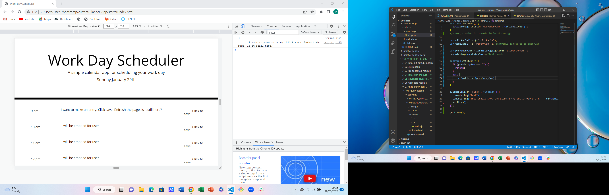

# Planner-App
Week 7 Challenge

1:30 LFC. but continue coding.
3:30 - 5 Back to week 6?
5 Tutor meeting.
Monday evening: speak to Rebecca.

Commit

Your notes have kind of switched to being in the script from here.
Work through them slowly.
3. How to change something by targeting its data attribute, or do I mean dataset values?! I mean... you could try changing something really simple just to check you know what you're doing, then undo it or comment it out. setAttribute or the jQuery equivalent MIGHT be helpful here, but I'm not sure.

Give yourself an easy thing to do break by updating the actual text content within the diary!

4. How to create a relationship between the current hour and the data attributes so that you're working with the correct things.
5. Make past hours grey, current hour red, future hours green.
6. While you're playing with the styling, why not make them look nicer by making them boxes if you can?

As time allows:
Further styling of the diary entry table. Can it look nicer with borders, etc.?
If you've set up the data attributes correctly, you can target them in the CSS.

Add some sort of hover effect on the save area so that it will be clearer for the user when they have saved. Or change them to buttons, but if so you'll have to change EVERYWHERE where they were referenced!

REAL README STARTS HERE:

Further practice with JavaScript
## Description
I wanted to create a daily planner that could be used for managing time effectively.
I wanted the daily planner to show the current day.
I wanted the daily planner to use colours to distinguish between the current hour, previous hours and future hours.
I wanted the planner to be able to accept user input into the middle columns and be able to be saved.
I wanted the planner to store the user input information into local storage such that it would continue to appear on refresh.
I wanted to practise use of jQuery to achieve this, especially functions, the use of .on('click'), moment.js and local storage.
I wanted to deploy my finished product and check it had no errors.

## Installation
n/a

## Usage
When the website is viewed, the user can see today's date, space to commit diary entries for each hour between 9 a.m. and 5 p.m., and where to click to save.

Site is published at https://philculling.github.io/Planner-App

Screenshot:

## Credits
Some help was provided by AskBCS Assistant.

## License
Please refer to the LICENSE in the repo.